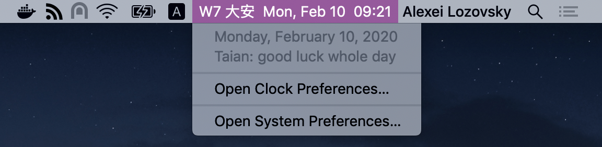

#  六曜時計 — Rokuyo Clock

Drop-in replacement for standard macOS clock with rokuyo fortune for the day and week numbers.

Displays time in any calendar or language.

**Rokuyo** is a _six-day_ cycle in Japanese lunisolar calendar, predicting (or prophesizing) how lucky your day will (not) be.

| Rokuyo | Reading    | Meaning                                    |
| ------ | ---------- | ------------------------------------------ |
|  先勝  | Sensho     | Start early: your morning is lucky         |
|  友引  | Tomobiki   | Day is okay, but noon is no good           |
|  先負  | Sembu      | Don’t rush and wait for the afternoon      |
|  仏滅  | Butsumetsu | The worst and most unlucky day             |
|  大安  | Taian      | The luckiest day, obviously. Do it!        |
|  赤口  | Shakku     | Well, a bad day, but noon has hope         |

Readings and meanings vary.
It’s your choice how to interpret them.

## 📦 Installing

1. [Download the latest release](https://example.com). <!-- TODO: actual URL -->
2. Double-click the app to launch the clock.
3. Hold ⌘ and drag it where you want.
4. Add your new clock to Login Items.
5. Hide the standard clock.

Updates are not provided automatically to keep application size to minimum.
Watch this GitHub project to be notified about new versions.
Though, I consider this program to be feature complete, bug fixes notwithstanding.

## 🛠 Building

1. Open Rokuyo.xcodeproj.
2. Press **⌘R**.

Why did I make this in the first place?
I thought it would be neat to see those fortune cookies daily.
Then, I also wanted some exercise in Cocoa localization.
Oh boy did I get it!
As it goes, computing rokuyo dates is easy ([NSDate+Extra.m](Rokuyo/Sources/NSDate+Extra.m))
but displaying them is definitely not ([DateFormatter.m](Rokuyo/Sources/DateFormatter.m)).
It gets surprisingly tricky if you drill into details, locales, scripts, calendars, etc.
[“Zach, whatever you do: just don’t _ever_ build a calendar!”](https://zachholman.com/talk/utc-is-enough-for-everyone-right)

## 📄 License

Rokuyo Clock is distributed under the terms of [**GNU GPL**](LICENSE) version 3 or any later version.
